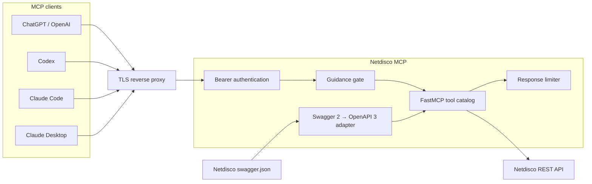
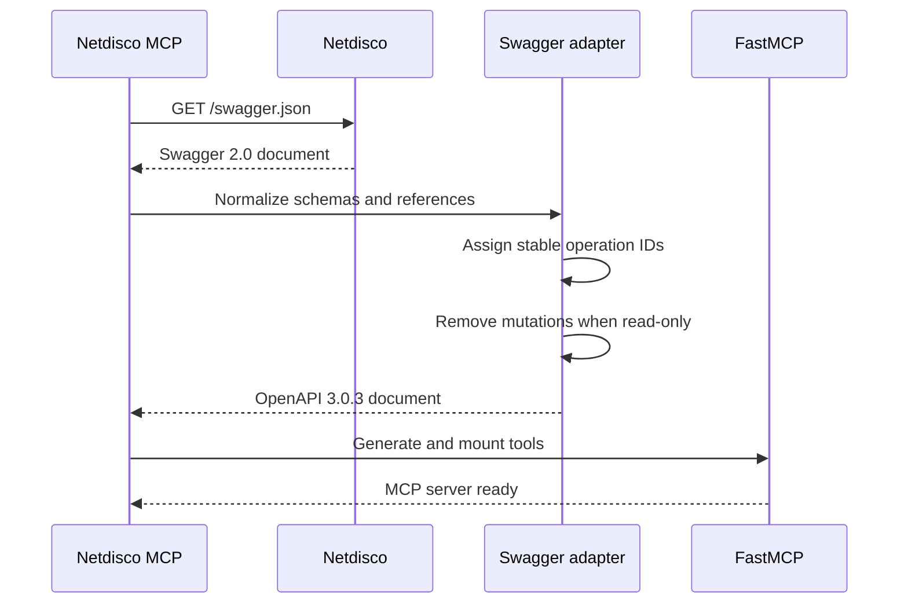
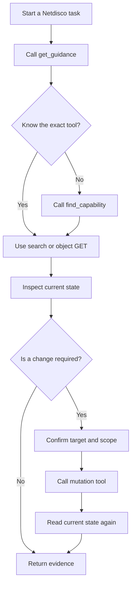
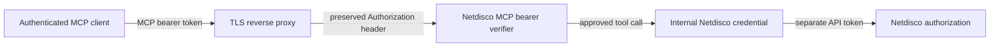

<div align="center">

# Netdisco MCP

### The complete Netdisco REST API, translated into an agent-native MCP server

[](https://www.python.org/)
[](https://github.com/omichelbraga/netdisco-mcp/actions/workflows/ci.yml)
[](https://gofastmcp.com/)
[](https://modelcontextprotocol.io/)
[](https://www.docker.com/)
[](LICENSE)

**81 tools · dynamic Swagger discovery · stdio + Streamable HTTP · guidance-first agent UX · bearer authentication**

</div>

---

Netdisco MCP turns a live Netdisco `swagger.json` document into a complete,
searchable MCP tool surface. It does not maintain a fragile handwritten subset
of endpoints. At startup it discovers the connected Netdisco version, upgrades
Swagger 2.0 to OpenAPI 3, repairs schema incompatibilities, assigns stable tool
names, and publishes every supported operation through FastMCP.

The result is an MCP server that can answer operational questions, inspect
devices and switch ports, search nodes and VLANs, run inventory reports, and—
when explicitly enabled—submit or remove Netdisco jobs.

> [!IMPORTANT]
> The live API is the source of truth. Tool counts can increase when Netdisco
> adds endpoints. The catalog in this README is a verified snapshot of
> Netdisco `2.103000`.

## Contents

- [Why this project exists](#why-this-project-exists)
- [Architecture](#architecture)
- [A productive agent workflow](#a-productive-agent-workflow)
- [Complete tool catalog](#complete-tool-catalog)
- [Quick start](#quick-start)
- [Configuration reference](#configuration-reference)
- [Connect MCP clients](#connect-mcp-clients)
- [Security model](#security-model)
- [How tools are generated](#how-tools-are-generated)
- [Repository layout](#repository-layout)
- [Development and testing](#development-and-testing)
- [Contributing](#contributing)

## Why this project exists

| Capability | What it means |
|---|---|
| Complete API coverage | Every operation advertised by the connected Netdisco instance becomes an MCP tool. |
| Upgrade-aware | A container restart reloads the live specification and discovers new endpoints. |
| Agent-first guidance | `get_guidance` is intentionally the first tool, and middleware redirects agents that skip it. |
| Capability discovery | `find_capability` searches names, routes, tags, methods, and descriptions. |
| Safer exploration | Read-only mode removes POST, PUT, PATCH, and DELETE operations before tool generation. |
| Context protection | Oversized responses are truncated with a clear hint to narrow the request. |
| Flexible transport | Run locally over stdio or remotely over MCP Streamable HTTP. |
| Remote authentication | Streamable HTTP can require a deployment-specific bearer token. |
| Container hardened | The supplied Compose service uses a read-only filesystem, `no-new-privileges`, and no host port. |

## Architecture



### Startup pipeline



## A productive agent workflow

The server is deliberately opinionated about how an AI agent should approach a
network-management task.



1. Call `get_guidance` once at the start of the working session.
2. Use `find_capability` when the correct tool is not obvious.
3. Prefer search and object tools before broad reports.
4. Inspect the current state before any mutation.
5. Verify the resulting state instead of interpreting a timeout as failure.

## Complete tool catalog

The verified Netdisco `2.103000` surface contains:

| Category | Tools |
|---|---:|
| Agent assistance | 2 |
| Objects | 31 |
| Reports | 34 |
| Queue | 5 |
| Search | 4 |
| User | 2 |
| General | 3 |
| **Total** | **81** |

Seven generated API tools use POST, PUT, or DELETE and are treated as
mutations. Set `NETDISCO_READ_ONLY=1` to remove those seven tools.

> [!CAUTION]
> Netdisco exposes `GET /logout`, which destroys the current API key and session
> despite using HTTP GET. Method-based read-only filtering cannot classify that
> endpoint as a mutation. Treat `get_logout` as destructive.

### Agent-assistance tools

| Tool | Purpose |
|---|---|
| `get_guidance` | Returns the bundled Netdisco operating guide and can highlight a topic-specific section. |
| `find_capability` | Searches the complete generated catalog by task, route, tag, HTTP method, or description. |

<details>
<summary><strong>Objects — 31 tools</strong></summary>

| Method | Tool | Netdisco route | Purpose |
|---|---|---|---|
| DELETE | `delete_device_jobs` | `/api/v1/object/device/{ip}/jobs` | Delete jobs and clear the skiplist for a device, optionally filtered by fields. |
| GET | `get_device` | `/api/v1/object/device/{ip}` | Return a row from the device table. |
| GET | `get_device_device_ips` | `/api/v1/object/device/{ip}/device_ips` | Return `device_ips` rows for a device. |
| GET | `get_device_modules` | `/api/v1/object/device/{ip}/modules` | Return module rows for a device. |
| GET | `get_device_neighbors` | `/api/v1/object/device/{ip}/neighbors` | Return layer-2 neighbor relationships for a device. |
| GET | `get_device_nodes` | `/api/v1/object/device/{ip}/nodes` | Return nodes found on a device. |
| GET | `get_device_port` | `/api/v1/object/device/{ip}/port/{port}` | Return a row from the `device_port` table. |
| GET | `get_device_port_active_nodes` | `/api/v1/object/device/{ip}/port/{port}/active_nodes` | Return active-node rows for a port. |
| GET | `get_device_port_active_nodes_with_age` | `/api/v1/object/device/{ip}/port/{port}/active_nodes_with_age` | Return active-node rows with age data for a port. |
| GET | `get_device_port_agg_master` | `/api/v1/object/device/{ip}/port/{port}/agg_master` | Return the aggregation-master entry for a port. |
| GET | `get_device_port_last_node` | `/api/v1/object/device/{ip}/port/{port}/last_node` | Return the last-node entry for a port. |
| GET | `get_device_port_logs` | `/api/v1/object/device/{ip}/port/{port}/logs` | Return log rows for a port. |
| GET | `get_device_port_neighbor` | `/api/v1/object/device/{ip}/port/{port}/neighbor` | Return the neighbor entry for a port. |
| GET | `get_device_port_nodes` | `/api/v1/object/device/{ip}/port/{port}/nodes` | Return node rows for a port. |
| GET | `get_device_port_nodes_with_age` | `/api/v1/object/device/{ip}/port/{port}/nodes_with_age` | Return node rows with age data for a port. |
| GET | `get_device_port_port_vlans` | `/api/v1/object/device/{ip}/port/{port}/port_vlans` | Return `port_vlans` rows for a port. |
| GET | `get_device_port_power` | `/api/v1/object/device/{ip}/port/{port}/power` | Return the power entry for a port. |
| GET | `get_device_port_properties` | `/api/v1/object/device/{ip}/port/{port}/properties` | Return the properties entry for a port. |
| GET | `get_device_port_ssid` | `/api/v1/object/device/{ip}/port/{port}/ssid` | Return the SSID entry for a port. |
| GET | `get_device_port_vlans` | `/api/v1/object/device/{ip}/port/{port}/vlans` | Return VLAN rows for a port. |
| GET | `get_device_port_wireless` | `/api/v1/object/device/{ip}/port/{port}/wireless` | Return the wireless entry for a port. |
| GET | `get_device_port_vlans_cd8cf56` | `/api/v1/object/device/{ip}/port_vlans` | Return `port_vlans` rows for a device. |
| GET | `get_device_ports` | `/api/v1/object/device/{ip}/ports` | Return port rows for a device. |
| GET | `get_device_power_modules` | `/api/v1/object/device/{ip}/power_modules` | Return PoE module status and aggregated port statistics. |
| GET | `get_device_powered_ports` | `/api/v1/object/device/{ip}/powered_ports` | Return powered-port rows for a device. |
| GET | `get_device_ssids` | `/api/v1/object/device/{ip}/ssids` | Return SSID rows for a device. |
| GET | `get_device_vlans` | `/api/v1/object/device/{ip}/vlans` | Return VLAN rows for a device. |
| GET | `get_device_wireless_ports` | `/api/v1/object/device/{ip}/wireless_ports` | Return wireless-port rows for a device. |
| GET | `get_vlan_nodes` | `/api/v1/object/vlan/{vlan}/nodes` | Return nodes found in a VLAN. |
| PUT | `update_device_arps` | `/api/v1/object/device/{ip}/arps` | Queue a job to store ARP entries found on a device. |
| PUT | `update_device_nodes` | `/api/v1/object/device/{ip}/nodes` | Queue a job to store nodes found on a device. |

</details>

<details>
<summary><strong>Reports — 34 tools</strong></summary>

| Method | Tool | Netdisco route | Report |
|---|---|---|---|
| GET | `get_report_device_deviceaddrnodns` | `/api/v1/report/device/deviceaddrnodns` | IP addresses without DNS entries. |
| GET | `get_report_device_devicebylocation` | `/api/v1/report/device/devicebylocation` | Inventory grouped by location. |
| GET | `get_report_device_devicednsmismatch` | `/api/v1/report/device/devicednsmismatch` | Device name and DNS mismatches. |
| GET | `get_report_device_deviceinventory` | `/api/v1/report/device/deviceinventory` | Device inventory. |
| GET | `get_report_device_devicemultipleaddresses` | `/api/v1/report/device/devicemultipleaddresses` | Devices with multiple addresses. |
| GET | `get_report_device_devicepoestatus` | `/api/v1/report/device/devicepoestatus` | Power over Ethernet status. |
| GET | `get_report_device_devicesharedaddresses` | `/api/v1/report/device/devicesharedaddresses` | IP addresses found on multiple devices. |
| GET | `get_report_device_devicesmissingmodeloros` | `/api/v1/report/device/devicesmissingmodeloros` | Devices missing model or operating-system data. |
| GET | `get_report_device_portutilization` | `/api/v1/report/device/portutilization` | Port utilization. |
| GET | `get_report_device_recentlyaddeddevices` | `/api/v1/report/device/recentlyaddeddevices` | Recently added devices. |
| GET | `get_report_ip_duplicateprivatenetworks` | `/api/v1/report/ip/duplicateprivatenetworks` | Duplicate private networks. |
| GET | `get_report_ip_ipinventory` | `/api/v1/report/ip/ipinventory` | IP inventory. |
| GET | `get_report_ip_subnets` | `/api/v1/report/ip/subnets` | Subnet utilization. |
| GET | `get_report_node_nodemultiips` | `/api/v1/report/node/nodemultiips` | Nodes with multiple active IP addresses. |
| GET | `get_report_node_nodesdiscovered` | `/api/v1/report/node/nodesdiscovered` | Nodes discovered through LLDP or CDP. |
| GET | `get_report_port_duplexmismatch` | `/api/v1/report/port/duplexmismatch` | Mismatched duplex settings. |
| GET | `get_report_port_halfduplex` | `/api/v1/report/port/halfduplex` | Ports operating in half-duplex mode. |
| GET | `get_report_port_portadmindown` | `/api/v1/report/port/portadmindown` | Administratively disabled ports. |
| GET | `get_report_port_portblocking` | `/api/v1/report/port/portblocking` | Ports blocked by spanning tree. |
| GET | `get_report_port_portmultinodes` | `/api/v1/report/port/portmultinodes` | Ports with multiple attached nodes. |
| GET | `get_report_port_portserrordisabled` | `/api/v1/report/port/portserrordisabled` | Error-disabled ports. |
| GET | `get_report_port_portssid` | `/api/v1/report/port/portssid` | Port SSID inventory. |
| GET | `get_report_port_portswithmostvlans` | `/api/v1/report/port/portswithmostvlans` | Ports carrying the most VLANs. |
| GET | `get_report_port_portvlanmismatch` | `/api/v1/report/port/portvlanmismatch` | Mismatched VLAN configurations. |
| GET | `get_report_vlan_devicevlancount` | `/api/v1/report/vlan/devicevlancount` | VLAN count per device. |
| GET | `get_report_vlan_vlaninventory` | `/api/v1/report/vlan/vlaninventory` | VLAN inventory. |
| GET | `get_report_vlan_vlanmultiplenames` | `/api/v1/report/vlan/vlanmultiplenames` | VLANs with multiple names. |
| GET | `get_report_vlan_vlansneverconfigured` | `/api/v1/report/vlan/vlansneverconfigured` | VLANs known but never configured. |
| GET | `get_report_vlan_vlansonlyuplinks` | `/api/v1/report/vlan/vlansonlyuplinks` | VLANs found only on uplinks. |
| GET | `get_report_vlan_vlansunused` | `/api/v1/report/vlan/vlansunused` | VLANs no longer in use. |
| GET | `get_report_wireless_apchanneldist` | `/api/v1/report/wireless/apchanneldist` | Access-point channel distribution. |
| GET | `get_report_wireless_apclients` | `/api/v1/report/wireless/apclients` | Access-point client counts. |
| GET | `get_report_wireless_apradiochannelpower` | `/api/v1/report/wireless/apradiochannelpower` | Access-point radio channel and power. |
| GET | `get_report_wireless_ssidinventory` | `/api/v1/report/wireless/ssidinventory` | SSID inventory. |

</details>

<details>
<summary><strong>Queue — 5 tools</strong></summary>

| Method | Tool | Netdisco route | Purpose |
|---|---|---|---|
| GET | `get_queue_backends` | `/api/v1/queue/backends` | List active Netdisco backend names. |
| GET | `get_queue_jobs` | `/api/v1/queue/jobs` | Return queued jobs with optional filters. |
| GET | `get_queue_status` | `/api/v1/queue/status` | Return job counts grouped by status. |
| POST | `create_queue_jobs` | `/api/v1/queue/jobs` | Submit jobs to the Netdisco queue. |
| DELETE | `delete_queue_jobs` | `/api/v1/queue/jobs` | Delete queue jobs and skiplist entries with optional filters. |

</details>

<details>
<summary><strong>Search — 4 tools</strong></summary>

| Method | Tool | Netdisco route | Purpose |
|---|---|---|---|
| GET | `search_device` | `/api/v1/search/device` | Search devices by identity, address, location, model, OS, vendor, and other attributes. |
| GET | `search_node` | `/api/v1/search/node` | Search nodes, including active and archived observations. |
| GET | `search_port` | `/api/v1/search/port` | Search switch ports by description and port characteristics. |
| GET | `search_vlan` | `/api/v1/search/vlan` | Search VLANs. |

</details>

<details>
<summary><strong>User — 2 tools</strong></summary>

| Method | Tool | Netdisco route | Purpose |
|---|---|---|---|
| GET | `get_users` | `/api/v1/users` | List users with roles and token status. |
| POST | `create_user` | `/api/v1/user` | Provision a token-only service account and issue or revoke its API token. |

</details>

<details>
<summary><strong>General — 3 tools</strong></summary>

| Method | Tool | Netdisco route | Purpose |
|---|---|---|---|
| GET | `get_statistics` | `/api/v1/statistics` | Return the latest Netdisco statistics row. |
| GET | `get_logout` | `/logout` | Destroy the current API key and session cookie; this has a destructive side effect. |
| POST | `create_login` | `/login` | Obtain a Netdisco API key. |

</details>

## Quick start

### Requirements

- Python 3.11 or newer
- A reachable Netdisco instance with `swagger.json`
- A permanent Netdisco API token or supported username/password credential
- Docker and Docker Compose for container deployment

### Local development

```bash
git clone https://github.com/omichelbraga/netdisco-mcp.git
cd netdisco-mcp
cp .env.example .env
```

Set the required values in `.env`:

```dotenv
NETDISCO_URL=https://netdisco.example.net
NETDISCO_API_TOKEN=replace-with-a-permanent-netdisco-token
```

Install, validate the live specification, and run:

```bash
uv sync --extra dev
uv run netdisco-mcp --check
uv run netdisco-mcp
```

The default transport is stdio.

### Docker Compose

The supplied Compose file expects the shared external network `mcp-edge` and
does not publish a host port.

```bash
docker network create mcp-edge
docker compose up --build -d
```

A reverse proxy on `mcp-edge` can reach the service at:

```text
http://netdisco-mcp:8000/mcp
```

## Configuration reference

| Setting | Default | Purpose |
|---|---:|---|
| `NETDISCO_URL` | required | Base URL of the Netdisco instance. |
| `NETDISCO_SPEC_URL` | `$NETDISCO_URL/swagger.json` | Override the live Swagger/OpenAPI URL. |
| `NETDISCO_API_TOKEN` | unset | Netdisco API credential sent to the upstream API. |
| `NETDISCO_AUTH_SCHEME` | `Bearer` | Authorization scheme; use `raw` for an unprefixed token. |
| `NETDISCO_USERNAME` | unset | Optional Netdisco Basic-auth username. |
| `NETDISCO_PASSWORD` | unset | Optional Netdisco Basic-auth password. |
| `NETDISCO_TLS_VERIFY` | `1` | Validate the Netdisco TLS certificate. |
| `NETDISCO_TIMEOUT` | `30` | Upstream request timeout in seconds. |
| `NETDISCO_READ_ONLY` | `0` | Remove POST, PUT, PATCH, and DELETE tools when set to `1`. |
| `NETDISCO_GUIDANCE_GATE` | `1` | Require guidance before normal tool use. |
| `NETDISCO_GUIDANCE_TTL` | `1800` | Guidance activity window in seconds. |
| `NETDISCO_MAX_RESPONSE_CHARS` | `50000` | Maximum tool-response size before truncation. |
| `NETDISCO_MCP_TRANSPORT` | `stdio` | `stdio` or `streamable-http`; `stdin` and `http` are accepted aliases. |
| `NETDISCO_MCP_HTTP_HOST` | `127.0.0.1` | Bind address for Streamable HTTP. |
| `NETDISCO_MCP_HTTP_PORT` | `8000` | Listening port inside the process or container. |
| `NETDISCO_MCP_BEARER_TOKEN` | unset | Static bearer token required by the HTTP transport when configured. |

> [!WARNING]
> `NETDISCO_API_TOKEN` authenticates the server to Netdisco.
> `NETDISCO_MCP_BEARER_TOKEN` authenticates MCP clients to this server. They
> protect different trust boundaries and should never share the same value.

## Connect MCP clients

### Claude Code

```bash
claude mcp add --transport http --scope user \
  netdisco-mcp https://netdisco-mcp.example.net/mcp \
  --header "Authorization: Bearer <mcp-bearer-token>"
```

Verify the connection:

```bash
claude mcp get netdisco-mcp
```

### Codex

Store the MCP bearer token in `NETDISCO_MCP_BEARER_TOKEN`, then add this entry
to `~/.codex/config.toml`:

```toml
[mcp_servers."netdisco-mcp"]
url = "https://netdisco-mcp.example.net/mcp"
bearer_token_env_var = "NETDISCO_MCP_BEARER_TOKEN"
default_tools_approval_mode = "prompt"
```

See the official [Codex MCP configuration](https://developers.openai.com/codex/mcp/)
for additional timeout, allow-list, and approval controls.

### Claude Desktop

Claude Desktop can use the included authenticated stdio proxy. The proxy keeps
the remote bearer token out of the MCP protocol messages sent by Desktop and
adds it only when connecting upstream.

```bash
fastmcp install claude-desktop \
  src/netdisco_mcp/desktop_proxy.py:mcp \
  --name netdisco-mcp \
  --with-editable . \
  --env NETDISCO_MCP_URL=https://netdisco-mcp.example.net/mcp \
  --env NETDISCO_MCP_BEARER_TOKEN=<mcp-bearer-token>
```

Restart Claude Desktop after installation.

### OpenAI Responses API

```python
import os

from openai import OpenAI

client = OpenAI()

response = client.responses.create(
    model="gpt-5.6",
    input="Call get_guidance, then summarize the Netdisco device inventory.",
    tools=[
        {
            "type": "mcp",
            "server_label": "netdisco",
            "server_url": "https://netdisco-mcp.example.net/mcp",
            "authorization": os.environ["NETDISCO_MCP_BEARER_TOKEN"],
            "require_approval": "always",
        }
    ],
)

print(response.output_text)
```

The `authorization` field follows the official
[remote MCP tool](https://platform.openai.com/docs/guides/tools-remote-mcp)
contract. Keeping `require_approval` set to `always` is appropriate for this
server because its live catalog can include mutation tools.

### Generic MCP client

```json
{
  "mcpServers": {
    "netdisco-mcp": {
      "type": "http",
      "url": "https://netdisco-mcp.example.net/mcp",
      "headers": {
        "Authorization": "Bearer <mcp-bearer-token>"
      }
    }
  }
}
```

## Security model



Security controls provided by the project:

- Constant-time comparison for the configured MCP bearer token.
- Separate MCP-client and Netdisco-upstream credentials.
- Optional method-based read-only tool filtering.
- Guidance middleware before operational tool use.
- Response-size limiting to protect model context.
- TLS verification for Netdisco by default.
- No host port in the supplied Compose file.
- Read-only container filesystem and `no-new-privileges`.

Recommended production controls:

- Terminate trusted TLS at the reverse proxy.
- Store both credentials in a secret manager or Portainer secret environment.
- Rotate credentials on a defined schedule and after accidental disclosure.
- Restrict the Netdisco credential to the minimum required role.
- Keep approval prompts enabled for mutation tools.
- Review reverse-proxy access logs and Netdisco job history.
- Use `NETDISCO_READ_ONLY=1` for discovery-only deployments.

## How tool generation works

Netdisco `2.103000` publishes Swagger 2.0 while FastMCP consumes OpenAPI 3.
The adapter performs the following transformations without removing supported
operations:

1. Rewrites Swagger references into OpenAPI `components` references.
2. Converts body and form parameters into OpenAPI request bodies.
3. Moves parameter type information into schemas.
4. Repairs Netdisco property-level `required` flags.
5. Normalizes boolean, integer, and array defaults.
6. Converts response schemas into media-type content entries.
7. Assigns deterministic, human-readable operation IDs.
8. Adds the original HTTP method and route to every tool description.
9. Removes write methods when read-only mode is enabled.

If two routes would receive the same friendly name, a deterministic seven-
character digest is appended. This explains names such as
`get_device_port_vlans_cd8cf56` and keeps the full API surface collision-free.

## Repository layout

```text
netdisco-mcp/
├── src/netdisco_mcp/
│   ├── __main__.py          # CLI and transport startup
│   ├── auth.py              # MCP bearer-token verification
│   ├── config.py            # Environment-driven settings
│   ├── desktop_proxy.py     # Authenticated Claude Desktop proxy
│   ├── guidance.py          # Guidance loading and enforcement
│   ├── server.py            # FastMCP assembly and tool mounting
│   ├── spec.py              # Swagger normalization and tool catalog
│   └── data/GUIDANCE.md     # Operating instructions for AI agents
├── tests/                   # Configuration, auth, and spec tests
├── compose.yaml             # Internal-network container deployment
├── Dockerfile
└── pyproject.toml
```

## Development and testing

Run the test suite:

```bash
uv run pytest
```

Validate the connected live API without starting a transport:

```bash
NETDISCO_URL=https://netdisco.example.net \
NETDISCO_API_TOKEN=<netdisco-api-token> \
uv run netdisco-mcp --check
```

The check reports API version coverage, read/write operation counts, total MCP
tools, and tags. Tests cover transport aliases, bearer verification, Swagger-
to-OpenAPI conversion, stable names, request bodies, schema repair, read-only
filtering, and capability discovery.

## Contributing

1. Fork the repository and create a focused branch.
2. Add tests for behavioral changes.
3. Run the full test suite against a representative Swagger fixture.
4. Run `netdisco-mcp --check` against an authorized Netdisco instance.
5. Open a pull request describing the user-visible behavior and verification.

Please do not commit Netdisco credentials, MCP bearer tokens, internal URLs, or
captured infrastructure data.

## License

Released under the [MIT License](LICENSE).
